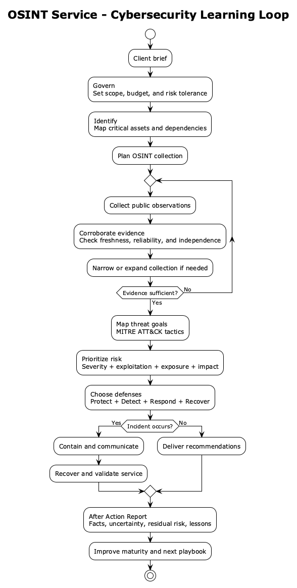

# Big Ambitions 8200 Mod — OSINT Service

調査日: 2026-09-12
Mod ID: `Unit-8200`
対象: Big Ambitions 1.0 系 / 公式 Modding SDK

> 実装状況: v0.1.1 MVP。OSINT事業、Hacker職、サーバー要件・日次費用、英日ローカライズ、ゲーム内フィールドガイドを収録しています。

## ビルドと導入

前提としてBig Ambitions本体、[IT Business Expansion](https://steamcommunity.com/sharedfiles/filedetails/?id=3741969623)、SkillKit（Workshop ID `3795855100`）を導入する。

macOSの標準Steam配置なら、Unityを起動せずに検証・パッケージを作成できる。

```sh
make check          # JSON、安定ID、Manifest、Unityメタデータ
make compile-check  # インストール済みゲームDLLに対するコンパイル
make package        # Output/Unit-8200 と dist/Unit-8200.zip を生成
```

別のSteam Libraryでは `MANAGED_DIR=/path/to/Managed make package` とする。ローカル確認は `Output/Unit-8200` をゲームの `ModsLocal` へ置く。公式SDKのUnity 2022.3.62f2からも `Big Ambitions > Mod Builder` で同じ構成をビルドできる。

## GitHub ReleaseとSteam Workshop公開

GitHub Releaseへ `Unit-8200.zip` を添付して公開すると、ワークフローがZIPのパス、必須DLL、英日JSONを検証する。Steam Guardを安全に扱うため、既存Workshopアイテムの更新はローカルのSteamCMDで毎回対話認証して行う。

Steamへ送るタイトル、BBCode説明文、アイキャッチ画像は `workshop/title.txt`、`workshop/description.txt`、`workshop/preview.jpg` で管理し、Releaseごとに同じ内容を反映する。

公開先: [Steam Workshop — 8200](https://steamcommunity.com/sharedfiles/filedetails/?id=3800064885)

`steamcmd` をPATHへ入れた状態で、リリースごとに次を実行する。SteamCMDがパスワードやSteam Guardコードを求めた場合は、その場で入力する。認証情報はファイル・GitHub・シェル履歴へ保存しない。

```sh
make workshop-publish RELEASE_TAG=v0.1.1
```

コマンドは最新のModをビルド・検証・パッケージ化してから、タイトル、BBCode説明、プレビュー画像とともにWorkshop ID `3800064885` を更新する。検証や認証に失敗した場合は成功扱いにしない。

## 1. 今回の結論

最初のリリースは、既存のオフィス事業ループを使う **OSINT Service** 1業種に絞る。

- オフィスを借りて `OSINT Service` を開業する
- `Hacker / ハッカー` を採用し、通常のコンピュータ席へ配置する
- IT Business Expansion の Blade / Rack / Mainframe Server を設備要件にする
- 稼働中のハッカー数とスキルに応じて、時間制の OSINT サービス売上を得る
- サーバーごとの電力・接続費を毎日支払う

独自の案件画面、侵入・攻撃ミニゲーム、諜報機関の物語、独自3Dサーバーは v1 には入れない。まず「新しい事業を選べる・採用できる・設備不足が表示される・売上と費用が動く」という Big Ambitions 標準の一周を成立させる。

## 2. 決定事項

### ゲーム上の位置づけ

| 項目 | v1 の決定 |
|---|---|
| 事業名 | OSINT Service / OSINTサービス |
| 建物 | Office |
| 顧客 | デジタル顧客のみ。来店客は出さない |
| 主職種 | Hacker / ハッカー |
| 職種の土台 | Programmer |
| 作業場所 | Programmer が使える標準コンピュータ席 |
| 追加設備 | IT Business Expansion の3種サーバー |
| 収益方式 | 時間料金。標準オフィス事業のシミュレーターを再利用 |
| 初期推奨料金 | `$300/hour`（実機テストで調整） |
| ハッカー賃金 | Programmer の `1.20x` |
| 研修費 | Programmer の `1.15x` |
| サーバー要件 | 75 m² ごとに1台、最大20台。3種のどれでも可 |
| サーバー費 | Blade `$40/day`、Rack `$80/day`、Mainframe `$160/day` |
| 対応言語 | English / 日本語 |
| 世界観上の境界 | 公開情報の調査・分析サービス。無許可侵入や実在組織の作戦再現は扱わない |

`$300/hour` は IT Business Expansion の Software Development (`$239`) と最上位 Cloud (`$600`) の中間に置いた仮値。高賃金の専門職と設備費を払っても成立しつつ、Cloud の上位互換にならないことをプレイテストで確認する。

### 安定 ID

セーブ互換性のため、表示名を変えても以下は変更しない。

```text
unit-8200:businesstype_osintservice
unit-8200:skill_hacker
unit-8200:itemname_hourlyosintfee
unit-8200:businessrequirement_serverinfrastructure
unit-8200:transaction_serverinfrastructure
```

依存先の設備 ID:

```text
it-services:itemname_bladeserver
it-services:itemname_serverrack
it-services:itemname_mainframeserver
```

IT Business Expansion には `it-services:itemname_rackserver` と旧 ID の `it-services:itemname_serverrack` を正規化する処理がある。8200側は販売・セーブ上で現に使われている `serverrack` をまず参照し、両方を受理する互換判定を持たせる。

## 3. 最小ゲームループ

1. プレイヤーが Office を借り、事業タイプ `OSINT Service` を選ぶ。
2. 標準の机・椅子・コンピュータを配置する。
3. Blade / Rack / Mainframe Server のいずれかを必要数配置する。
4. City Workforce Inc. から `Hacker` を採用する。
5. Hacker をコンピュータ席へ割り当て、営業時間を設定する。
6. BizMan で OSINT 時間料金を設定する。
7. 営業中の有効な Hacker 席が売上を生み、日替わり時にサーバー費が引かれる。

サーバーは売上倍率には使わず、v1 では「事業成立の設備要件」と「固定費」に限定する。サーバーの種類で料金や品質を変える仕組みは、基本ループのバランスが取れた後に追加する。

## 4. 実装方式

### 基盤

新規プロジェクトは [Big Ambitions 公式 Modding SDK](https://github.com/hovgaardgames/bigambitions) のクリーンな `main` を土台にした。既存の `Big-Ambitions-Server-Rack-Mod` の作業中ファイルは取り込んでいない。SDKのSteam検出とローカルMod導入だけはmacOSにも対応させた。

公式 SDK の `Example-BusinessType` と `Example-Furniture` を、公開 API とアセット構成の基準にする。Unity は SDK 指定の `2022.3.62f2` を使う。

### 実行時の役割

実装は当面1つの C# ファイル内の2エントリに収める。

- `Unit8200Mod` (`ModEntryOnInitializationLoad`)
  - vanillaのProgrammer FeeとWeb Development Agencyを実行時に複製する
  - 独自AssetBundleなしで時間料金 Item と OSINT BusinessTypeを登録する
  - Item / BusinessType を登録する
  - SkillKit が準備できたら Hacker を登録する
- `Unit8200CityMod` (`ModEntryOnCityLoad`)
  - Web Development Agency の simulator と標準オフィス要件を借りる
  - OSINT BusinessType にサーバー要件を追加する
  - Hacker を標準 Programmer ワークステーションへ結びつける
  - 日次のサーバー費を一度だけ請求する
  - unload 時にイベント購読と登録内容を戻す

専用のサービス層、設定画面、永続ストアはまだ作らない。

### BusinessType

`Example-BusinessType/ToyStore.asset` を直接流用するのではなく、OSINT用 BusinessType asset を作り、city load 後に vanilla の `ba:businesstype_webdevelopmentagency` から simulator と business requirements を補う。

主要設定:

```text
businessTypeName: unit-8200:businesstype_osintservice
suitableBuildingType: ba:buildingtype_office
spawnCustomers: false
businessProducts:
  - unit-8200:itemname_hourlyosintfee
employeePrimarySkills:
  - unit-8200:skill_hacker
tags:
  - ba:businesstag_allowplayercreation
  - ba:businesstag_generatesrevenue
```

Web Development Agency の simulator を使うことで、デジタル顧客、コンピュータ席、勤務中従業員による売上、BizMan の価格設定を最小の独自コードで得る。

### Hacker 職

[SkillKit](#参考資料) を必須依存にし、次の定義を登録する。

```json
{
  "skillName": "unit-8200:skill_hacker",
  "name": "Hacker",
  "cloneFromSkill": "ba:skill_programmer",
  "workstationCloneFrom": "ba:skill_programmer",
  "secondarySkill": "ba:skill_negotiation",
  "secondarySkillRangeMin": 10,
  "secondarySkillRangeMax": 40,
  "businesses": ["unit-8200:businesstype_osintservice"],
  "cloneWageMultiplier": 1.2,
  "cloneTrainingCostMultiplier": 1.15,
  "skipVanillaBusinessInherit": true
}
```

`skipVanillaBusinessInherit` は Hacker が通常の Web Development Agency の求人へ漏れるのを防ぐ。採用元は Programmer と同じ City Workforce Inc. を継承する。

SkillKit DLL はコンパイル参照にも配布物にも複製しない。リフレクション経由で `SkillHooks.RunWhenReady` を呼び、Workshopの別ModとしてロードされたSkillKitを利用する。Steam Workshop側ではSkillKitをRequired Itemに設定する。

### サーバー要件と費用

IT Business Expansion のサーバーアセットはコピー・再配布せず、登録済み Item ID を参照する。

要件は `SpecificItemsInBuildingBySqm` を実行時生成し、以下を設定する。

```text
items: Blade Server / Rack Server (new + legacy IDs) / Mainframe Server
squareMetersPerItem: 75
maxItems: 20
todoTaskItemName: it-services:itemname_bladeserver
```

IT Business Expansion の日次請求処理は同 Mod の3業種だけを対象にするため、OSINT Service のサーバー費は8200側で請求する。`onNewDay` ごとにプレイヤー所有の OSINT Service を走査し、設置されたサーバーの合計を1日1回だけ引く。Item drop 時には要件表示だけを更新し、同日二重請求はしない。

## 5. 依存関係

### 必須

1. **IT Business Expansion** — サーバー3種、販売先、アイコン、既存セーブ互換処理
2. **SkillKit** — Hacker の求人、賃金、研修、ワークステーション割り当て

依存 Mod がない場合は、事業だけが半端に登録される状態を避ける。初期化時に必要な Item ID と SkillKit を確認し、不足時は OSINT BusinessType を登録せず、明示的なエラーをログへ残す。ユーザー通知 API が安定して使える場合だけゲーム内通知も出す。

### 依存を減らす代替案

IT Business Expansion への依存が将来不安定なら、次段階で `Big-Ambitions-Server-Rack-Mod` の自作ラックと標準PCだけを使う独立版へ切り替えられる。ただし家具販売、日次費用、アイコン、3D品質、セーブ移行を8200側で保守することになるため、v1では選ばない。

## 6. 参考 Mod の調査結果

| 参考 | 採用する点 | 採用しない点 / 注意 |
|---|---|---|
| [IT Business Expansion](https://steamcommunity.com/sharedfiles/filedetails/?id=3741969623) | オフィス型デジタル顧客、時間料金、サーバー要件、日次インフラ費、競合への展開 | コードやAssetBundleをコピーしない。Workshop説明とローカル実装で販売店表記に差があり、実機確認が必要 |
| 公式 `Example-BusinessType` | BusinessType / Item / AssetBundle の登録と解除 | 小売店の customer / product source 設定はOSINTへ持ち込まない |
| SkillKit (Workshop ID `3795855100`) | Programmer を元にした Hacker、求人会社、賃金、研修、PC割り当て | 必須依存が1つ増える。DLLを同梱して二重ロードさせない |
| [Silicon Alley](https://steamcommunity.com/workshop/filedetails/?id=3748024318) | 将来の案件フェーズ、品質、評判、継続収益の参考 | v1から独自案件UIを作ると範囲が大きすぎるため見送る |
| [Deep Ventures](https://steamcommunity.com/workshop/filedetails/?id=3752960042) | 複数業種・サービス Item の追加例 | 5業種・専用仕入先・多数商品は今回の1業種MVPには不要 |
| `Big-Ambitions-Server-Rack-Mod` | 公式家具テンプレートからCubeだけでラックを生成する独立版の保険 | 現在は配置家具までで事業効果がなく、作業ツリーもdirtyなので直接流用しない |
| [Big Hax](https://steamcommunity.com/workshop/filedetails/?id=3744259108) | なし | 名前は近いがチート/QoL Modであり、OSINT事業の参考にはならない |

### IT Business Expansion のローカル調査で確認したこと

インストール済み Workshop item `3741969623` の配布物を読み取り、次を確認した。

- 事業は Web Development Agency の simulator と標準要件を再利用している
- Blade / Rack / Mainframe を `SpecificItemsInBuildingBySqm` で要求している
- サーバー費は `$40 / $80 / $160` を日次イベントで請求する
- custom skill は Programmer を clone し、SkillKit の準備完了後に求人・職場へ bind する
- 競合とオフィス内装テンプレートは Web Development Agency の設定を複製する
- Rack Server には旧 Item ID と壊れたPrefabに対する互換・復旧処理がある

これは挙動と互換条件を把握するための調査であり、配布 DLL、逆コンパイル結果、Meshy製3Dアセットは8200へ収録しない。

## 7. 実装フェーズと完了条件

### Phase 0 — 新規SDKプロジェクト

- 公式 SDK `main` を `Big-Ambitions-8200-Mod` にクリーン取得
- 既存のこの設計メモを維持
- Unity 2022.3.62f2 でゲーム DLL を import
- SkillKitは実行時リフレクションで接続し、DLLをコンパイル参照・配布対象にしない

完了条件: 公式 examples がコンパイルでき、Mod Builder が起動する。

### Phase 1 — OSINT事業の最小動作

- manifest / asmdef / en・ja locales
- OSINT hourly fee Item
- OSINT BusinessType
- Hacker 登録
- Web Development Agency simulator / PC要件の再利用

完了条件: 新規テストセーブで事業を作成し、Hacker を採用・配置でき、1時間後に売上が記録される。

### Phase 2 — サーバー要件と固定費

- 4つの互換 Item ID を設備として認識
- 面積連動の必要台数を BizMan に表示
- 日次インフラ費を1回だけ請求
- unload / save-load / dependency missing を処理

完了条件: 設備不足で事業要件が失敗し、設置後に成功する。2日進めて各日1件だけ正額の支出が記録される。

### Phase 3 — 互換性と配布準備

- Windows / macOS AssetBundle build
- 依存 Mod の Required Item 設定
- 日本語・英語表示確認
- 新規セーブと既存セーブで enable / disable / reload を確認
- アイコンと Workshop thumbnail を独自制作

完了条件: クラッシュ、raw localization key、二重請求、SkillKit二重DLL、消える家具がない。

## 8. テスト観点

最低限、次のシナリオを通す。

| シナリオ | 期待結果 |
|---|---|
| 両依存ありで新規開業 | OSINT Service が選べる |
| Hackerを検索・採用 | City Workforce Inc. に求人が出る |
| HackerをPCへ配置 | Programmer用PCを使用できる |
| サーバー0台 | 設備要件が未達になる |
| Blade 1台 | 小規模Officeで設備要件を満たす |
| Rack旧/新ID | どちらも台数として数える |
| 日付変更 | サーバー構成どおり1回だけ課金される |
| 同日に家具を持ち直す | 二重課金されない |
| SkillKitなし | OSINT事業を登録せず、クラッシュしない |
| IT Business Expansionなし | OSINT事業を登録せず、クラッシュしない |
| Modを無効化して再読込 | イベント購読・BusinessType・Itemが残らない |
| 日本語/英語切替 | raw ID が表示されない |

## 9. 先に潰すべきリスク

1. **ロード順**: IT Business Expansion の Item 登録前に8200が要件を作る可能性がある。Itemの存在確認を city load まで遅らせ、短い再試行に上限を設ける。
2. **SkillKitのロード順**: 別Workshop ModのDLLが準備前なら登録できない。初期化とcity loadで準備完了を確認し、配布ZIPへ`SkillKit.dll`を混入させない。
3. **料金Itemと市場需要**: Item登録だけで BizMan の料金と顧客需要が更新されるかは実機検証が必要。IT Business Expansion と同様に price cache / market demand refresh が必要になる可能性がある。
4. **標準PC要件**: simulatorだけでなく Web Development Agency の requirements を正しく複製しないと、PCなしでも営業できる可能性がある。BusinessType登録後の要件一覧をログで確認する。
5. **Blueprint互換**: IT Business Expansion の Workshop コメントには office blueprint が使えない報告がある。v1の出荷条件には含めず、手動配置を正式ルートにする。
6. **名称と表現**: 実在の部隊章・公式ロゴ・実在作戦は使わず、架空の企業ブランドとして扱う。

## 10. 未決事項

- 表示名を `8200`、`Unit 8200`、または架空名 `Signal 8200` のどれにするか
- `Hacker` をそのまま日本語の「ハッカー」にするか、説明上は「OSINTアナリスト」を併記するか
- Hacker の副技能を Negotiation にするか Customer Service にするか
- 初期料金 `$300/hour` とサーバー密度 `75 m²/台` の実測バランス
- v2で案件フェーズ（収集 → 検証 → 分析 → 報告）を追加するか
- v2でサーバー種別を案件品質・処理容量へ反映するか

## 参考資料

- [Big Ambitions 公式 Modding SDK](https://github.com/hovgaardgames/bigambitions)
- [Steam Workshop: IT Business Expansion](https://steamcommunity.com/sharedfiles/filedetails/?id=3741969623)
- [Steam Workshop: Silicon Alley](https://steamcommunity.com/workshop/filedetails/?id=3748024318)
- [Steam Workshop: Deep Ventures](https://steamcommunity.com/workshop/filedetails/?id=3752960042)
- ローカル SkillKit README: Workshop item `3795855100/Skills/README.txt`

## 11. サイバーセキュリティ学習ゲームとしての方向性

### 中心コンセプト

プレイヤーに用語クイズを解かせるのではなく、**限られた時間・予算・不完全な証拠から、何を優先して守るか決めさせる**。正解発表では「正しかった／間違った」だけでなく、判断に使うべき観点を短く返す。

学習の背骨には NIST Cybersecurity Framework 2.0 の6機能を使う。

```text
GOVERN  方針・責任・許容リスクを決める
IDENTIFY 守る資産と依存関係を把握する
PROTECT  事故を起こりにくくする
DETECT   異常を見つけ、真偽と影響を分析する
RESPOND  封じ込め、連絡し、被害拡大を止める
RECOVER  復旧し、学びを次の改善へ戻す
```

これを案件の一本道にはしない。NIST CSF 2.0と同様、Govern / Identify / Protect / Detect は継続的に進み、インシデント時に Respond / Recover が割り込む構造にする。

### プレイヤーが身につける7つの感覚

1. **資産が分からなければ守れない** — まずシステム、データ、利用者、外部委託先を把握する。
2. **脅威・脆弱性・リスクは別物** — 弱点があっても、露出や事業影響で優先度は変わる。
3. **深刻度だけで直す順番を決めない** — CVSS、悪用実績、公開範囲、資産価値を合わせて判断する。
4. **予防だけでは足りない** — 検知、対応、復旧へ予算を配る。
5. **単一情報源を信じ切らない** — 情報の鮮度、信頼性、独立した裏取りを意識する。
6. **帰属には不確実性がある** — 断定を急ぐと信用と契約を失う。
7. **セキュリティは経営判断** — 最強の対策ではなく、事業継続に合う対策を選ぶ。

## 12. リッチ版の案件ループ



### 1. 依頼受領

顧客から短いブリーフが来る。

- 業種: EC、病院、製造、SaaS、自治体など
- 守りたいもの: 顧客情報、決済、設計図、稼働継続、ブランド
- 予算と期限
- 法務・プライバシー条件
- 現在分かっている兆候

同じ技術的問題でも、顧客の事業によって優先順位が変わるようにする。

### 2. スコープと資産整理

調査対象カードから、重要な資産と依存関係を選ぶ。全部を選ぶと費用とノイズが増える。

例:

- 公開Webサイト
- 認証基盤
- 社員メール
- クラウドストレージ
- 決済サービス
- 委託先のアップデート経路
- バックアップ

ここで資産台帳とデータフローの重要性を学ばせる。

### 3. OSINT収集計画

公開情報源を選んで調査キューを作る。実在サイトへアクセスする機能にはせず、ゲーム内の架空データセットを使う。

| 情報源 | 得意 | 弱点 |
|---|---|---|
| 公開DNS・証明書 | 外部公開資産の発見 | 所有者や用途を誤認しやすい |
| 求人・技術ブログ | 技術スタックの推測 | 古い情報が混ざる |
| 公開コード・設定断片 | 依存関係や露出の兆候 | 本番利用とは限らない |
| ベンダー情報 | 脆弱性と対策 | 顧客環境への該当性は別判断 |
| SNS・報道 | 初動の兆候 | 誤情報と重複が多い |
| 脅威共有情報 | IOC・TTP・推奨対策 | 共有範囲と鮮度に制約がある |

情報源ごとに `cost`、`time`、`freshness`、`reliability`、`legal risk` を持たせる。

### 4. 証拠の検証

集めた観測結果を、独立した複数ソースで裏取りする。プレイヤーは各Findingへ信頼度を付ける。

```text
未確認 → 可能性あり → 蓋然性が高い → 確認済み
```

早く断定すると納期は短くなるが、誤検知や誤帰属で顧客信頼を失う。裏取りを増やすと品質は上がるが、期限と人件費を消費する。

### 5. 脅威のモデル化

Findingを MITRE ATT&CK の戦術レベルへ対応付ける。具体的な侵入コマンドではなく、「攻撃者が何を達成しようとしているか」を扱う。

初期に使う戦術は次の6つに絞る。

- Reconnaissance — 下調べ
- Initial Access — 最初の侵入口
- Credential Access — 認証情報の取得
- Collection — 目的データの収集
- Exfiltration — データの持ち出し
- Impact — 停止・破壊・改ざん

全ATT&CK Techniqueをゲームへ持ち込まず、案件カードに必要なものだけをタグとして表示する。

### 6. リスク優先順位付け

画面上は次の4軸で比較する。

```text
技術的深刻度 × 悪用可能性 × 資産の事業影響 × 証拠の確度
```

CVSS値は「技術的深刻度」の材料に限定する。ゲーム中には、たとえば次の選択を出す。

- CVSS 9.8だが、隔離された検証機で悪用兆候なし
- CVSS 7.5だが、インターネット公開された決済サーバーで悪用確認あり

後者を先に扱うことで、Base scoreだけでなく脅威・環境コンテキストを見る考え方を学べる。

### 7. 対策提案

MITRE D3FENDを参考に、Findingへ防御カードを割り当てる。

- Asset Inventory
- Multi-Factor Authentication
- Least Privilege
- Secure Configuration
- Patch / Update
- Network Segmentation
- Logging and Alerting
- Backup and Restore Test
- Incident Response Playbook
- Supplier Review

対策カードには導入費、運用費、必要スキル、カバー範囲、副作用を持たせる。「高価な製品を買えば全部解決」にはしない。

### 8. インシデント割り込み

検知や復旧を軽視した会社では、通常案件中にインシデントが発生しやすくなる。

1. 事実と推測を分ける
2. 影響範囲を確認する
3. 封じ込めを選ぶ
4. 顧客・法務・経営への連絡順を決める
5. 復旧方法を選ぶ
6. 再発防止を決める

「すぐ全サーバー停止」は被害を抑える一方、顧客業務も止める。隔離、監視継続、認証情報失効などのトレードオフを作る。

### 9. レポートと振り返り

案件終了時に、売上だけでなく短いAfter Action Reportを出す。

```text
確認できた事実
まだ不明な点
最優先リスク
採用した対策と残余リスク
見逃した兆候
次回改善する手順
関連: NIST CSF / ATT&CK / OWASP
```

評価は `速さ`、`証拠品質`、`リスク低減`、`説明力`、`法令・倫理順守` の5軸にする。満点を取りにくくし、案件ごとに最適解が変わるようにする。

## 13. 案件タイプ案

| 案件 | 主に学ぶこと | 代表的な判断 |
|---|---|---|
| 外部公開資産調査 | 資産管理、攻撃対象領域 | 古いサブドメインを本番資産と断定するか |
| 脆弱性トリアージ | CVSSと現実のリスクの違い | 高スコアと悪用確認済みのどちらを先に直すか |
| フィッシング監視 | 証拠、ブランド保護、連絡 | 類似ドメインを即断で悪性扱いするか |
| 認証情報漏えい対応 | 認証、MFA、失効、通知 | 誰の認証情報をどの順番で無効化するか |
| サプライチェーン調査 | 依存関係、第三者リスク | 人気だけで安全性を判断するか |
| Webアプリ診断報告 | OWASP Top 10、修正優先度 | 症状ではなく設計・設定の原因を直せるか |
| ランサムウェア演習 | 分離、バックアップ、復旧 | 未検証バックアップを信用するか |
| インシデント初動支援 | 検知、封じ込め、通信 | 証拠保全と早期復旧をどう両立するか |
| M&Aセキュリティ調査 | Governance、残余リスク | 不明点を価格・契約条件へ反映するか |

すべて架空組織・架空ドメイン・架空脆弱性を使用する。現実のCVEを出す場合も、悪用手順ではなく影響、優先順位、修正状況だけを教材化する。

## 14. 人材を「ハッカー1職」で終わらせない案

NICE Frameworkは、職業名ではなくチームが担う作業をWork Roleとして分ける。ゲームでも、会社の成長に合わせて役割を分化させると、セキュリティが複数分野の協働であることを表現できる。

| ゲーム内職種 | 主能力 | 得意フェーズ |
|---|---|---|
| OSINT Analyst | 収集・裏取り | Identify / Detect |
| Threat Intelligence Analyst | TTP整理・予測 | Govern / Identify / Detect |
| Security Engineer | 対策設計 | Protect / Detect |
| Incident Responder | 封じ込め・復旧 | Respond / Recover |
| Security Consultant | 顧客説明・残余リスク | Govern / Report |

ただし最初の実装は `Hacker` 1職のままにする。会社レベルまたは研修によって専門化を解禁し、別職種は案件システムが成立してから追加する。

## 15. 設備に意味を持たせる案

既存家具を単なる必要台数ではなく、案件能力へ結びつける。

| 設備 | ゲーム効果 | 学習メッセージ |
|---|---|---|
| PC + Hacker | 調査スロットと処理速度 | 人と作業環境が基本単位 |
| Blade Server | 同時収集キュー | データを集めるだけでは判断できない |
| Rack Server | 相関分析・ノイズ低減 | 複数ログの関連付けが検知を支える |
| Mainframe Server | 履歴保持・大規模案件 | 保持期間と事業規模はコストになる |
| Backup Appliance（将来） | 復旧成功率 | バックアップは復元テストまでが対策 |
| Network Sensor（将来） | 早期検知 | 観測できない事象には対応できない |

サーバーを増やすほど自動的に安全になる設計は避ける。設備は能力上限を上げ、成果は人材・方針・判断で決まる。

## 16. 会社の成長とアンロック

進行は売上額だけでなく、NIST CSFの成熟度に相当する `Security Maturity` で管理する。

| 段階 | 解禁 | プレイヤーが学ぶこと |
|---|---|---|
| 1 Reactive | 資産調査、簡易レポート | まず把握する |
| 2 Managed | 脆弱性トリアージ、ログ監視 | 優先順位と可視化 |
| 3 Repeatable | Playbook、役割分担、復旧テスト | 再現可能なプロセス |
| 4 Adaptive | 高度な複合案件、脅威共有 | 学びを継続改善へ戻す |

成熟度は「高価な家具の購入」だけでは上がらない。案件後の改善、研修、手順書、復旧テスト、誤検知率などを条件にする。

## 17. 教え方のUI原則

- **先に選ばせ、後で理由を返す**: 長いチュートリアルを読ませてから選ばせない。
- **用語へ常時ツールチップ**: Threat、Vulnerability、Risk、Control、Residual Riskをその場で確認できる。
- **事実と推測を色ではなくラベルでも区別**: アクセシビリティを確保する。
- **失敗をゲームオーバーにしない**: 利益、信頼、復旧時間へ影響させ、振り返り材料にする。
- **フレームワーク名を答えにしない**: ATT&CK ID暗記ではなく、攻撃目的と防御判断を評価する。
- **短い現場メモ**: 各案件終了時に1つだけ、実務へ持ち帰れる要点を出す。
- **Guided / Standard**: Guidedでは判断後に定義とヒントを表示し、Standardでは結果と振り返りだけを表示する。

## 18. 教材データの設計

案件はコードへ直書きせず、ローカライズ可能なJSONで持つ。

```json
{
  "id": "case_exposed_payment_server",
  "clientSector": "ecommerce",
  "learningObjectives": ["risk-context", "active-exploitation"],
  "frameworkTags": ["CSF.ID.RA", "ATTACK.TA0001", "OWASP.A02:2025"],
  "assets": ["payment-api", "test-server"],
  "observations": ["public-exposure", "known-exploitation", "weak-evidence"],
  "choices": ["patch-now", "isolate-first", "monitor-only"],
  "debriefKey": "unit-8200:debrief_exposed_payment_server"
}
```

JSONは教材内容だけを持ち、報酬計算や状態遷移は共通コードに置く。v1は5案件程度を手書きし、外部APIや現実の脅威フィードは接続しない。

## 19. 実装優先順位の更新案

前回のPhase 1〜3の後へ、次を追加する。

### Phase 4 — 学習できる最小案件

- 依頼 → 情報源選択 → Finding確認 → 優先順位 → レポートの5画面
- 5案件
- 8枚程度の対策カード
- 証拠の鮮度・信頼性・裏取り
- After Action Report

完了条件: プレイヤーが「CVSS最大を常に先に直す」より、悪用実績・露出・事業影響を合わせた判断で高評価を得られる。

### Phase 5 — 防御ライフサイクル

- Detect / Respond / Recover の割り込みイベント
- バックアップ復元テスト
- Playbookと役割分担
- Security Maturity 4段階

完了条件: Protectだけへ全投資する戦略より、検知・対応・復旧へ配分した戦略が長期的に安定する。

### Phase 6 — コンテンツ拡張

- OWASP Top 10:2025 を題材にした案件群
- ATT&CK戦術別の脅威シナリオ
- 業種別の事業影響
- 職種の専門化

完了条件: 新規案件をJSONとローカライズ追加だけで投入でき、共通コード変更を必要としない。

## 20. 学習効果の確認

ゲーム内テレメトリの外部送信は行わない。ローカルの実績・自己確認だけにする。

- 同じ種類の案件で優先順位判断が改善したか
- 単一ソース断定が減ったか
- CVSSだけでなく悪用実績・露出・資産価値を確認したか
- Protect偏重からDetect / Respond / Recoverへ配分できたか
- After Action Reportで残余リスクを明示できたか

「用語を覚えたか」ではなく、「次の案件で判断が変わったか」を学習成果にする。

## サイバーセキュリティ設計の参考資料

- [NIST Cybersecurity Framework 2.0](https://www.nist.gov/publications/nist-cybersecurity-framework-csf-20)
- [MITRE ATT&CK Enterprise Tactics](https://attack.mitre.org/tactics/)
- [MITRE D3FEND](https://d3fend.mitre.org/about/)
- [OWASP Top 10:2025](https://owasp.org/Top10/2025/)
- [FIRST CVSS v4.0](https://www.first.org/cvss/v4.0/specification-document)
- [CISA Known Exploited Vulnerabilities Catalog](https://www.cisa.gov/known-exploited-vulnerabilities-catalog)
- [NIST NICE Workforce Framework](https://www.nist.gov/itl/applied-cybersecurity/nice/nice-framework-resource-center)
- [NIST SP 800-150: Guide to Cyber Threat Information Sharing](https://www.nist.gov/publications/guide-cyber-threat-information-sharing)
